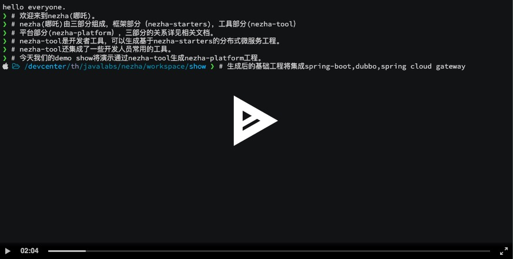
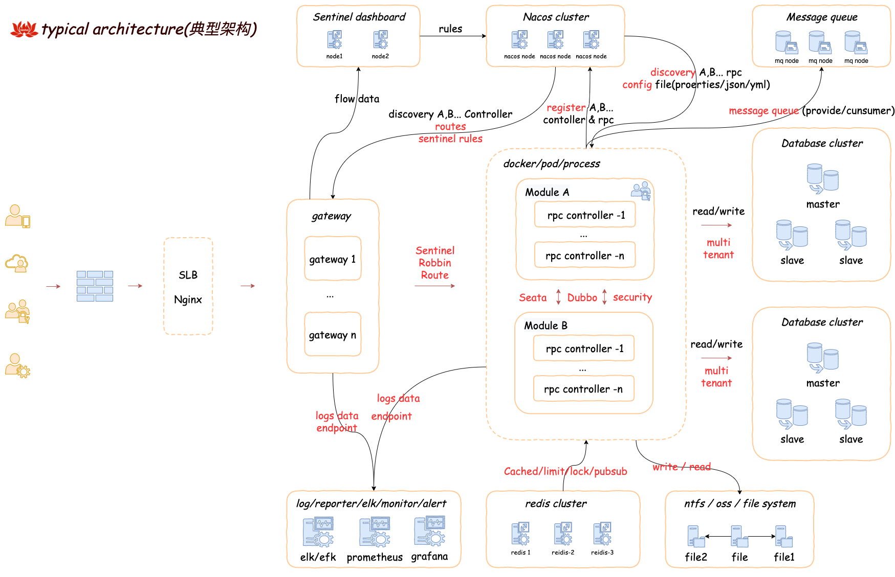

image::docs/images/nezha.png[align="center",width=550,height=104]
----
nezha(哪吒) is a distributed micro service framework that base on Spring boot、 Dubbo、Nacos、
Springcloud gateway、Spring security、Sentinel、Seata、Caffeine、RocketMq、Redis、Mybatis、
Mybatis-plus、Druid、Swagger、Knife4j、Hutool and other excellent projects.

include three parts :

- nezha-starters: a framework.
- nezha-tools: a command tool for developers. project level code generate and other commands.
- nezha-platform: a platform. include some business modules. e.g.: cms, log, resource, member, shop etc.
----
=== nezha demo
***

=== nezha feature keywords
***
`spring` `dubbo` `distributed` `webmvc` `webflux` `micro service` `quick` `multi tenant` `cache`

`flow limit` `i18n` `docker` `k8s` `security` `distributed transaction` `dynamically gateway`

`flexible configuration` `project level generate`

=== nezha typical architecture
***

## goals and vision
***
- Selectively integrate excellent open source projects; Thinking efficient development, team collaboration, automated operation and maintenance, make nezha as better as it can;
- Become a low-threshold, but highly reliable, highly stable, highly secure, and efficient distributed micro service framework.
- Build nezha-tool for developer。
- Build nezha-platform for company's **_informatization construction_**。

NOTE:  Goals of the informatization construction: The three aspects of architecture, tools, and platform ecology work together to reduce the development cycle, reduce development costs, quickly output products, bridge the digital divide, avoid repeated construction, and effectively centralize the management of data and IT assets in a process, system, and automation!

## include below contents ：
***
. Java8,spring boot2
. Package dependency combing
. Unified return value, error handling
. Unified dynamic configuration management
. Dynamic micro services gateway
. Automatic micro services discovery
. Spring security
. Status management and automatic generation with i18n
. Sentinal for flow control
. Unified log processing
. Distributed transaction
. Caffeine、Redis cache and secondary level cache.
. Redis route limit、lock and pubsub.
. Message queue
. Multi-database support, multi-tenant support, Multi-database pool support.
. Web development common configuration
. Webflux error messages configuration
. Project level code generation
. Swagger support.

## Modules
***
|==========
|module | desc | completeness
|nezha-bom-starter &nbsp;&nbsp;&nbsp;&nbsp;&nbsp;&nbsp;&nbsp;&nbsp;&nbsp;&nbsp;&nbsp;&nbsp;&nbsp;&nbsp;&nbsp;&nbsp;&nbsp;&nbsp;&nbsp;&nbsp;&nbsp;&nbsp;&nbsp;&nbsp;&nbsp;&nbsp;&nbsp;&nbsp;&nbsp;&nbsp;&nbsp;&nbsp;&nbsp;&nbsp;&nbsp;&nbsp;&nbsp;&nbsp;&nbsp;&nbsp;&nbsp;&nbsp;&nbsp;&nbsp;&nbsp;&nbsp;&nbsp;&nbsp;&nbsp;| packages manager | perfect
|nezha-common-starter | common module，include hutool | perfect
|nezha-core-starter | core module | perfect
|nezha-core-web-starter | general integration of web development，api return unified format, unified error handling，Json format typical config，web development typical config | perfect ，optimizing
|nezha-web-security-starter | integrate spring-security,nezha-core, use jjwt , realize MultipleTokenAuthenticationFilter,include username-password、sms code、email code etc. login model. token security added. | perfect ，optimizing
|nezha-core-webflux-starter | integrate Spring webflux, unified error handling | perfecting
|nezha-gateway-starter | integrate nezha-core-webflux,spring-cloud gateway, sentinel, alibaba-sentinel-gateway，dynamic gateway， dynamic flow limit | optimizing ##integrated sentinel##
|nezha-log-starter | log | perfect
|nezha-i18n-starter | i18n | perfect
|nezha-db-starter |integrate mybatis-plus | perfect
|nezha-druid-starter | nacos | perfect
|nezha-cache-starter | integrate Caffeine、redis, two-level cache | perfect，optimizing
|nezha-redis-starter | integrate redis，realize lock,limit,pubsub,redis operator | perfect
|nezha-dubbo-starter | integrate dubbo | perfect
|nezha-nacos-starter | integrate nacos，global dynamic configuration，yaml、json Converter and operator | perfect
|nezha-seata-starter | integrate seata | perfect
|nezha-sentinel-starter | integrate sentinel | developing
|nezha-rocketmq-starter | integrate rocketmq | developing
|nezha-i18n | nezha i18n status code | perfect
|nezha-i18n-generator | nezha i18n status code generator | perfect
|nezha-distribution | nezha distribution | perfect
|==========

## Version
***
nezha version：`main version` . `sub version` . `revision version` - `version note`  eg：0.0.46-202x207-RELEASE

nezha release words：every release version will select 8 sentences of "Thousand Characters classic" in order as the release words.

NOTE: version：Springboot first version + Springboot second version 'x' + Dubbo first version + Dubbo second + '-' + nezha phase version [BETA|RC|RELEASE|SNAPSHOT]

## Thanks
***
Spring boot, Spring cloud gateway, Spring security, Apache dubbo, sentinel, seata, nacos, redis, caffeine, rocketmq, mybatis-plus, mybatis, hutool, Swagger, Knife4j, druid, disruptor, aviator etc. etc. All projects introduced in nezha-bom-starter , also many excellent open source projects(used or studied in previous projects ), ex: jFinal, jBoot, t-io, xxl-job, taro, ant-design, vue etc.
