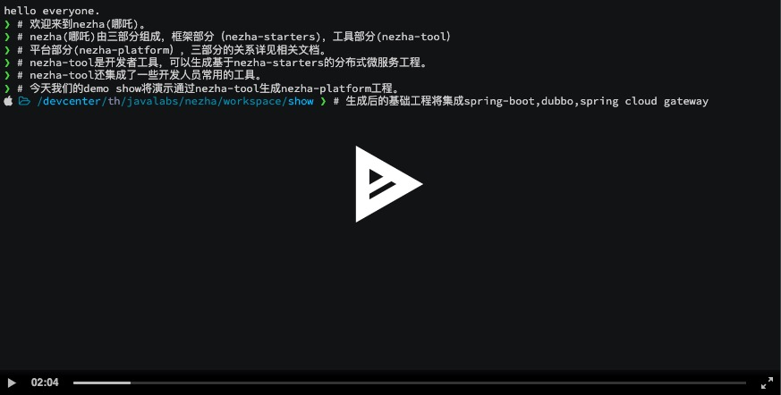
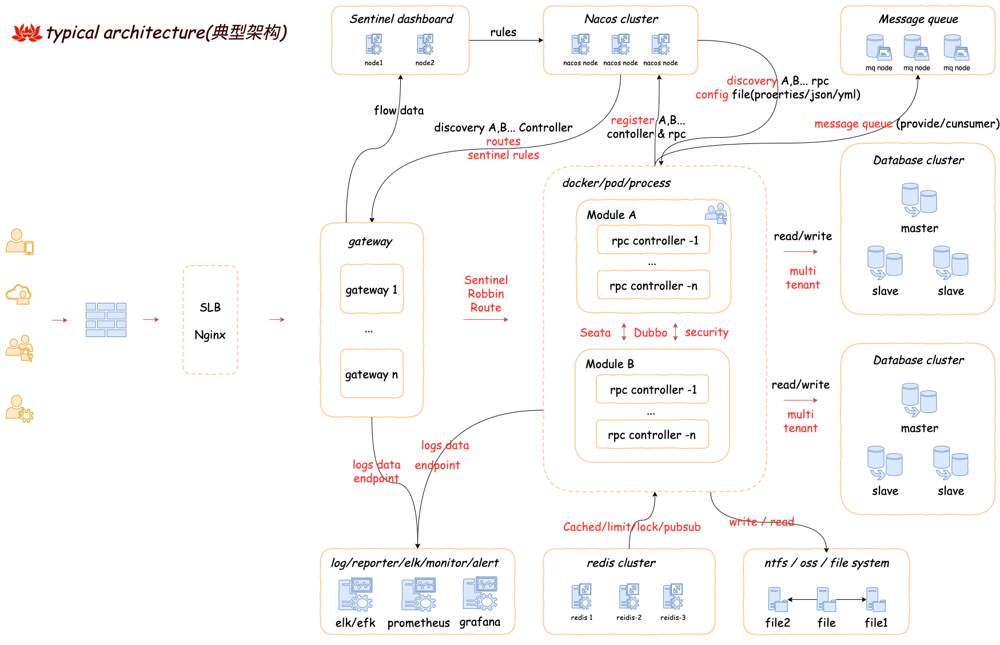

image::docs/images/nezha.png[align="center",width=550,height=104]
----
nezha(哪吒)是基于Spring boot、Dubbo、Nacos、Spring cloud gateway、Spring security、Sentinel、Seata、
Caffeine、RocketMq、Redis、Mybatis、Mybatis-plus、HikariCP、Druid、Swagger、Knife4j、Hutool等优秀项目之上，
结合多个项目的实施经验，总结的一套分布式微服务快速开发框架, 开箱即用。

包括三大部分：
. nezha-starters: 框架部分。
. nezha-tool: 命令行工具部分，项目级代码生成，常用的命名行工具。通过共享软件的形式发布。
. nezha-platform: 多业务单元集合平台。模块化业务单元，如：权限、资源、日志、用户、商城、CMS等。
----
=== nezha演示
***

=== NEZHA特点关键词
***
`Spring体系` `Dubbo` `分布式` `webmvc` `webflux` `微服务` `快速` `多租户` `缓存` `流控` `国际化` `docker` `k8s`

`安全框架` `分布式事务` `动态路由` `配置灵活` `项目级自动生成`

=== nezha典型部署架构
***

=== nezha目标及愿景
***
- 有选择的集成优秀开源项目，有选择的集成各项目的运行方式，将高效开发、团队协作、自动化运维融入其中的分布式微服务快速开发框架；
- 形成低门槛，但高可靠、高稳定、高安全、高效的分布式微服务框架。
- 构建nezha-tool开发工具，服务于开发者。
- 构建nezha-platform应用生态，服务于各企业##**_信息化建设_**##。

NOTE:  信息化建设目标: 架构、工具、平台生态三个方面共同作用, 达到降低开发周期、降低开发成本、快速输出产品、打通数字鸿沟、避免重复建设、有效集中管理数据和IT资产流程化、系统化、自动化！

=== nezha包括以下几个方面内容：
***
. java8,spring boot2
. 包依赖梳理
. 统一返回值、错误处理
. 统一动态配置管理
. 动态微服务网关
. 自动微服务发现
. 安全框架扩展
. 国际化状态管理及自动生成
. 流控管理
. 日志统一处理
. 分布式事务
. 基于Caffeine、Redis缓存及二级缓存
. 基于Redis访问控制、锁、pubsub
. 消息队列
. 多数据库支持、多租户支持、多连接池支持
. Web开发常规设置集成
. Webflux开发集成[错误处理]
. 基于工程级(project)的代码生成
. Swagger文档集成

=== 框架组成
***
|==========
|项目名 | 介绍 | 完善度
|nezha-bom-starter &nbsp;&nbsp;&nbsp;&nbsp;&nbsp;&nbsp;&nbsp;&nbsp;&nbsp;&nbsp;&nbsp;&nbsp;&nbsp;&nbsp;&nbsp;&nbsp;&nbsp;&nbsp;&nbsp;&nbsp;&nbsp;&nbsp;&nbsp;&nbsp;&nbsp;&nbsp;&nbsp;&nbsp;&nbsp;&nbsp;&nbsp;&nbsp;&nbsp;&nbsp;&nbsp;&nbsp;&nbsp;&nbsp;&nbsp;&nbsp;&nbsp;&nbsp;&nbsp;&nbsp;&nbsp;&nbsp;&nbsp;&nbsp;&nbsp; | 包引用管理 | 完善
|nezha-common-starter | 通用模块，引入了hutool | 完善
|nezha-core-starter | core | 完善
|nezha-core-web-starter | web开发常规集成，Rest返回统一错误处理，统一返回值处理，Json格式化输出扩展，web开发常规操作 | 完善，持续重构
|nezha-web-security-starter | 集成Spring-security,nezha-core,实现基于jjwt的 token授权机制,实现MultipleTokenAuthenticationFilter,以实现账号密码、第三方授权、验证码等多种登录形式。在token安全性也进行了处理。 | 完善，持续重构
|nezha-core-webflux-starter | 集成Spring webflux, 统一错误处理 | 待持续完善
|nezha-gateway-starter | 集成nezha-core-webflux,spring-cloud gateway, sentinel, alibaba-sentinel-gateway，动态路由，动态限流 | 持续优化 ##已经集成sentinel##
|nezha-log-starter | log | 完善
|nezha-i18n-starter | i18n | 完善
|nezha-db-starter |集成 mybatis-plus | 完善
|nezha-druid-starter | nacos | 完善
|nezha-cache-starter | 集成Caffeine、redis,并重写二级缓存 | 完善，持续优化
|nezha-redis-starter | 集成redis项目，实现lock,limit,pubsub,工具化redis操作 | 完善
|nezha-dubbo-starter | 集成dubbo项目 | 完善
|nezha-nacos-starter | 集成nacos项目，全局动态配置，yaml和json Converter及操作工具化 | 完善
|nezha-seata-starter | 集成Seata项目 | 完善
|nezha-sentinel-starter | 集成sentinel | 待完善
|nezha-rocketmq-starter | 集成rocketmq | 待完善
|nezha-i18n | nezha框架多语言状态码 | 完善
|nezha-i18n-generator | nezha 状态码自动生成项目 | 完善
|nezha-distribution | nezha自动分发包项目 | 完善
|==========

=== 版本发布
***
nezha版本号：`主版本号` . `子版本号` . `修正版本号` - `版本号标记`  例如：0.0.46-202x207-RELEASE

nezha版本发布词：每次版本更新，顺序选取8句《千字文》作为版本发布词。《千字文》很博大精深，值得传播，另外也是期望在开源领域做些微薄贡献的同时，也传播下中国文化。

NOTE: 版本号标记：Springboot主版本 + 二位Springboot子版本 + 'x' + Dubbo主版本 + 二位Dubbo子版本 + '-' + nezha阶段版本[BETA|RC|RELEASE|SNAPSHOT]

=== 感谢
***
Spring boot, Spring Cloud gateway, Spring security, Apache dubbo, sentinel, seata, nacos, redis, caffeine, rocketmq, mybatis-plus, mybatis, hutool, Swagger, Knife4j, druid, disruptor, aviator等所有在nezha-bom-starter中被引入的项目, 以及很多优秀的开源项目(之前项目中用过或者研究过), 如：jFinal, jBoot, t-io，xxl-job, taro, ant-design, vue 等
